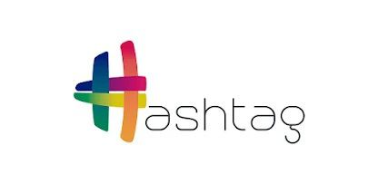

<h1 align="center">
  <span style="color:#306998;">Hashtag Treinamentos</span> — <br>
  <span style="color:#FFD43B;">Automação de <br> E-mails com Python </span> <br>
  📧
</h1>

<p align="center">

</p>

<p align="center">
Projeto de uma aplicação real em Python para <strong>automação de e-mails corporativos</strong>, integração com planilhas, geração de relatórios gerenciais, envio automático de mensagens personalizadas e notificações push a cada envio. 💻
<br><br>

</p>

<h2 align="center">💻⛏️ Tecnologias e Ferramentas Utilizadas: <br>
</h2>

<div align="center">
 <br>


 <br>


</div>

<h2 align="center">👨🏻‍💻 Autor deste Repositório: </h2>
<div align="center">
  
<strong>Lucas Paguetti Pereira</strong> 🧙‍♂️<br>
🏫 <strong>Instituição:</strong> Cesar School 🎓🧡<br>
📍 Recife, Pernambuco — <strong>Brazil</strong> 🇧🇷

<a href="https://www.instagram.com/lucpaguetti/">
  
</a>
<a href="https://github.com/wqiluc">
  
</a>
<a href="https://www.linkedin.com/in/lucas-paguetti-pereira-70267339b/">
   <br>
</a>
  <br>
</a>
</a>
<a href="https://discord.com/users/lucaspaguettipereira">
  
</a>
</div>

<h2 align="center">🌐 Hashtag Treinamentos: </h2>

<div align="center">
<a href="https://www.hashtagtreinamentos.com">
  
</a>
<a href="https://www.youtube.com/@HashtagProgramacao">
  
</a>
<a href="https://www.instagram.com/hashtagtreinamentos/">
  
</a>
<a href="https://www.linkedin.com/company/hashtag-treinamentos/">
  
</a>
</div>

<h2 align="center">🏛️ Arquitetura do Projeto: 
<br>
</h2>

<pre>
Automacao_E-mails_Python/
├── img /
│   ├── Hashtag_logo.jpeg 
│   └── Hashtag_logo2.jpeg 
│
├── projeto /
│   ├── automação.py    
│   ├── apoio.py 
│   ├── cores.py 
│   ├── docstring.py 
│   ├── docstring.ipynb 
│   └── Vendas.xlsx 
│
├── .gitignore 
├── README.md 
└── license 
</pre>

<h2 align="center">🎯 Objetivo do Repositório: <br>
</h2>

<p align="center">
Aprender e aplicar técnicas de <strong>automação de e-mails com Python</strong>, integrando planilhas, calculando resultados e enviando relatórios automaticamente, de forma prática e eficiente ✅📊.
</p>

<h2 align="center">📂 Scripts do Projeto <br>
</h2>

###  `projeto/automação.py`

Script principal da automação. Abre o Google Chrome, acessa a pasta do Drive com a planilha de vendas, lê o arquivo **Vendas.xlsx** com **Pandas** e calcula o **faturamento total** e a **quantidade de produtos vendidos**. Em seguida, monta o assunto e o corpo do e-mail com o relatório e o envia **10 vezes** via Gmail — a cada envio, dispara também uma notificação push no celular através do webhook do **Pushcut**.

###  `projeto/apoio.py`

Script auxiliar de desenvolvimento. Aguarda 7 segundos (tempo para posicionar o mouse) e imprime as coordenadas exatas do cursor via `pyautogui.position()`. Usado para descobrir as posições de tela (`pyautogui.click(x=..., y=...)`) necessárias em `automação.py`.

```py
python3 projeto/apoio.py
# → posicione o mouse e aguarde 7s → imprime (x, y)
```

###  [](https://raccoon.ninja/pt/post/dev/tabela-de-cores-ansi-python/) `projeto/cores.py`

Módulo de **constantes de cores ANSI** para saída formatada no terminal. Define variáveis como `Verde`, `Amarelo`, `Negrito`, `Reset`, etc., importadas por `automação.py` para colorir as mensagens de progresso impressas no console durante o envio dos e-mails.

###  `projeto/docstring.py` & `projeto/docstring.ipynb`

Documentação narrada do desafio: descreve o objetivo do projeto, as bibliotecas utilizadas e o passo a passo do fluxo de automação (acessar o sistema → navegar até os relatórios → baixar a base → calcular indicadores → enviar e-mail). Disponível tanto em script `.py` quanto em notebook `.ipynb` para leitura interativa.

<h2 align="center">🔁 Fluxo de Automação <br>
</h2>

```
[automação.py]
      │
      ▼
Abre o Google Chrome  ──►  Acessa a pasta do Drive (Vendas.xlsx)
      │
      ▼
pandas.read_excel("projeto/Vendas.xlsx")
      │
      ▼
faturamento_empresa = soma da coluna "Valor Final"
quantidade_empresa_produtos = soma da coluna "Quantidade"
      │
      ▼
Monta assunto + corpo do e-mail com o relatório
      │
      ▼
┌────────────── repete 10x ──────────────┐
│                                         │
│  Abre nova aba → Gmail                  │
│  Cola destinatário / assunto / corpo    │
│  ⌘ + Enter  →  envia o e-mail ✅         │
│                                         │
│  Abre nova aba → Pushcut (webhook)      │
│  Notifica o celular do envio 📲          │
│                                         │
└─────────────────────────────────────────┘
      │
      ▼
Imprime no terminal o resumo do Drive com os dados 🖥️
```

<h2 align="center">📲 Notificações via Pushcut <br>

</div></h2>

A cada e-mail enviado com sucesso, `automação.py` abre uma nova aba e acessa a URL no navegadir e dispara o webhook da **Pushcut** (`webhook_url`), o que dispara uma notificação push no celular do dono do projeto confirmando o envio — útil para acompanhar o progresso da automação sem precisar olhar para a tela do computador.

> [!CAUTION]
> A URL do webhook em `automação.py` é pessoal e vinculada à conta Pushcut do autor. Para reutilizar o projeto, substitua `webhook_url` por um webhook próprio criado no app Pushcut (iOs only🔺).

<h2 align="center">▶️ Como rodar o projeto: <br>
</h2>

<p align="center">
Este projeto lê a planilha <strong>Vendas.xlsx</strong> diretamente da pasta do projeto e executa a automação completa 🤖📊
</p>

**1️⃣ Abrindo o terminal no seu sistema operacional**

<p align="center">

</p>

```bash
# Spotlight (⌘ + Espaço) → digite "Terminal" → Enter
```

<p align="center">

</p>

```bash
# Pressione Ctrl + Alt + T
# ou procure por "Terminal" no menu de aplicativos
```

<p align="center">

</p>

```bash
# Pressione Win + R → digite "cmd" → Enter
# ou pesquise por "Prompt de Comando" no menu Iniciar
# (Se estiver usando PowerShell, funciona da mesma forma)
```

<p align="center">

</p>

```bash
# 2️⃣ Navegue até a pasta do projeto

cd caminho/para/a/pasta/Projeto

# Exemplo:
# cd ~/Desktop/Projeto

# 3️⃣ Confira se os arquivos estão no lugar certo 📂
ls projeto

# Você deve ver algo como:
# automação.py
# apoio.py
# cores.py
# docstring.py
# docstring.ipynb
# Vendas.xlsx

# 4️⃣ Instale as dependências do projeto 📦
pip install pandas pyautogui pyperclip openpyxl

# 5️⃣ (Opcional) Verifique se a planilha existe
ls projeto/Vendas.xlsx

# 6️⃣ Execute o script 🚀
python3 projeto/automação.py

# ⚠️ Importante: mantenha o mouse parado e não minimize as janelas
# durante a execução — o script controla o teclado e o mouse via PyAutoGUI.
```

<h2 align="center">🔑 Versões Utilizadas: <br>
</h2>
<p align="center">
  
  
  
  
  
</p>
